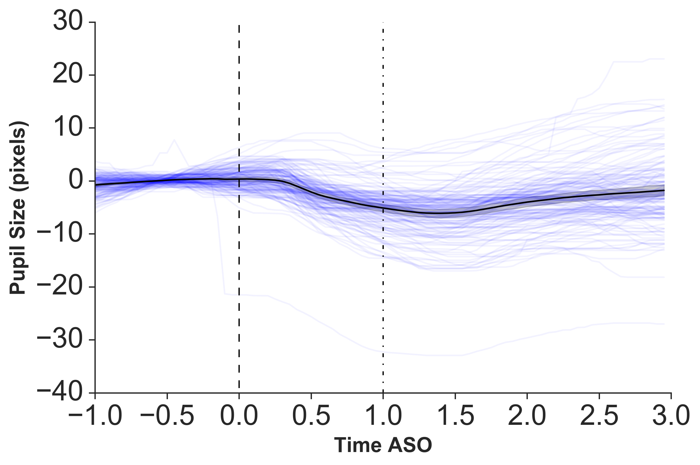
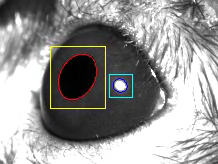
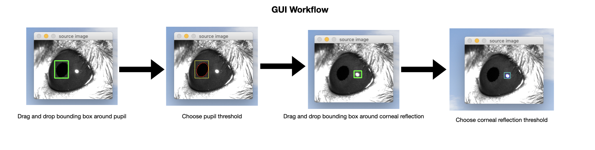

# minimal_eyetracker

The code contained in this repository implements a simple eyetracker developed by Cesar Echavarria for use in his thesis project in the Cox Lab at Harvard University. This code was developed and used with rodents in the context of a neuroscience-based experiment in which awake behaving animals viewed a variety of visual stimuli. 

The processing pipeline takes in timestamped image frames of the subject's eye and information about the timing of stimulus onset and ultimately outputs pupil size and movement values relative to the stimulus onset such as these sample plots:



**Vertical dashed lines** indicate the boundaries of the 1-second period in which a visual stimulus was presented. **Light blue traces** indicate pupil metrics during individual stimulus presentations. The **black trace** indicates the average pupil metric value over time.


The processing pipeline also outputs an [**annotated movie**](./sample_output/movie) indicating the bounding box and inferred boundaies of the pupil and the reflection of the IR light on the cornea of the subject. The latter is useful to correct changes in pupil location due to mouth movements which lead to motion of the whole eye ball in rodents. A sample annotated movie can be found under 
\
 **Sample Annotated Image**
\
 
\
 Under the hood the processing scripts take the intial bounding boxes defined by the user and fit ellipses to the dark or light regions that the bounding box overlaps in order to locate the boundaries of the pupil or corneal reflection, respectively. The bounding boxes and fitted ellipses are updated for each frame and blink events are detected based on failures to locate the pupil or corneal reflection.

## Materials

 The eyes of experimental subjects were illuminated with an [infrared light](https://www.amazon.com/Waterproof-Illuminator-Vision-Outdoor-Security/dp/B07NZ97VY4/ref=sr_1_19?_encoding=UTF8&c=ts&dchild=1&keywords=IR+Illuminators&qid=1621026769&s=security-surveillance&sr=1-19&ts_id=7161095011) and images were captured at a steady frame rate with a [CCD camera](https://www.alliedvision.com/en/products/cameras/detail/Manta/G-033.html)


## Installation instructions

A requirements.txt is provided with the repo containing the necessary packages for this code

```
# using pip
pip install -r requirements.txt

# using Conda
conda create --name <env_name> --file requirements.txt
```

## Running Code

### Define bounding boxes

Launch GUI from command lineto define bounding box around pupil and corneal rerflection of IR light
```
python minimal_eyetracker/define_seed.py
```
follow instructions in terminal to define bounding boxes.
\
 
\

### Run processing pipeline

Run processing pipeline with default arguments from command line
```
python process_data.py
```

Use --help for a list of possible user-defined parameters
